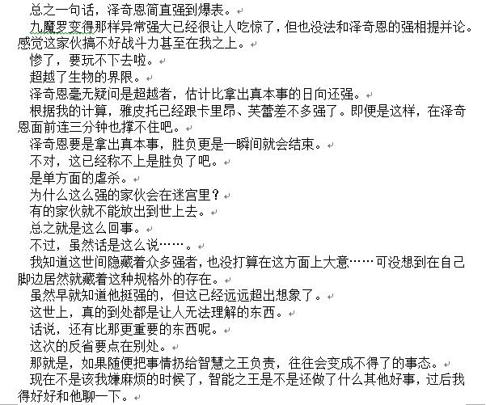
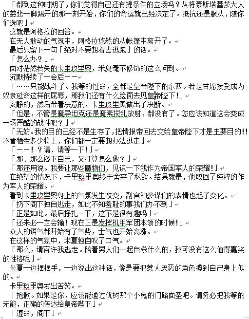

# baidu_OCR
##about

python3, test in linux. I think it can be used in MacOS or Windows.
## dependence
``` pip3 install baidu-aip ```
## use
```  python3 baidu_OCR.py --init  ```   
input APP_ID which get in [百度](https://console.bce.baidu.com)
then  

 ``` python3 baidu_OCR.py -i inputfile  ```   
it will output to stdout

``` python3 baidu_OCR.py -i inputfile -o outputfile  ```
``` python3 baidu_OCR.py -i http://url -o outputfile  ```

## result    


```
总之一句话,泽奇恩简直强到爆表。  
九魔罗变得那样异常强大已经很让人吃惊了,但也没法和泽奇恩的强相提并论。  
感觉这家伙搞不好战斗力甚至在我之上。  
惨了,要玩不下去啦。  
超越了生物的界限。  
泽奇恩毫无疑问是超越者,估计比拿出真本事的日向还强。   
根据我的计算,雅皮托已经跟卡里昂、芙蕾差不多强了。即便是这样,在泽奇  
恩面前连三分钟也撑不住吧。  
泽奇恩要是拿出真本事,胜负更是一瞬间就会结束。  
不对,这已经称不上是胜负了吧。  
是单方面的虐杀。  
为什么这么强的家伙会在迷宫里?  
有的家伙就不能放出到世上去。  
总之就是这么回事。  
不过,虽然话是这么说…。  
我知道这世间隐藏着众多强者,也没打算在这方面上大意…可没想到在自己  
脚边居然就藏着这种规格外的存在。  
虽然早就知道他挺强的,但这已经远远超出想象了。  
这世上,真的到处都是让人无法理解的东西。  
话说,还有比那更重要的东西呢。  
这次的反省要点在别处。  
那就是,如果随便把事情扔给智慧之王负责,往往会变成不得了的事态。  
现在不是该我嫌麻烦的时候了,智能之王是不是还做了什么其他好事,过后我  
得好好和他聊一下。  
```

<table>
  <tr>
<td > <center>

  
</center></td>

<td ><center>  

```
「都到这种时期了,你们觉得自己还有提条件的立场吗?从将泰斯塔蕾莎大人
的慈悲一脚踢开的那一刻开始,你们的命运就已经决定了。抵抗还是服从,随你
们选吧」
这就是阿格拉的回答。
最后只留下一句「绝对不要想着去逃跑」的话
在无人敢动的气氛中,阿格拉悠然的从帐篷中离开了
「怎么办?」
面对茫然若失的卡里玖里奥,米夏毫不修饰的这么问到。
沉默持续了一会后一一
「……只能战斗了。我等的性命,全都是皇帝陛下的东西。若是甘愿接受成为
奴隶延命这样的屈辱,那我们还有什么脸面去见皇帝陛下!」
安静的,然后带着决意的,卡里玖里奥做出了决断。
「但是,不管是魔导坦克还是魔素搅乱放射,没有了。您应该知道这会变成
场严酷的战斗吧?」
「无妨。我的目的已经不是生存了,把情报带回去交给皇帝陛下才是主要目的!
不管牺牲多少将士,你们都一定要想办法逃走」
「!?请、请等一下!」
「那、那么阁下自己,又打算怎么做?」
「那还用说。我要让那些魔物们,见识一下我作为帝国军人的荣耀!
在绝望的情况下,卡里玖里奥终于舍弃了私欲。结果就是,他取回了纯粹的作
为军人的荣耀。
看到卡里玖里奥身上的气氛发生改变,副官和参谋们的表情也起了变化。
「扔下阁下独自逃走,如此不知羞耻的事我们办不到」
「正是如此。最后挣扎一下,这不是很有趣吗」
「还未必一定会输!现在正是发挥机甲军团本领的时候!」
众人的语气都开始有了气势,士气也开始高涨。
在这样的气氛中,米夏独自叹了口气
「那么,请容许我逃走。陪着男人们一起自杀什么的,我可没有这么值得嘉奖
的性格呢」
米夏一边摆摆手,一边说出这种话,像是要把惹人厌恶的角色揽到自己身上似
的
。
卡里玖里奥发出苦笑。
「抱歉。如果是你,应该能通过优树那个小鬼的门路面圣吧。请务必把我等的
无能,正确的传达给皇帝陛下」
「遵命,阁下」
```

</center></td>
</tr>
</table>
